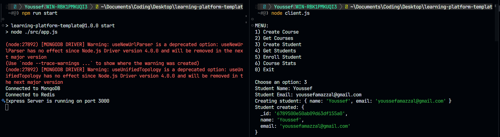
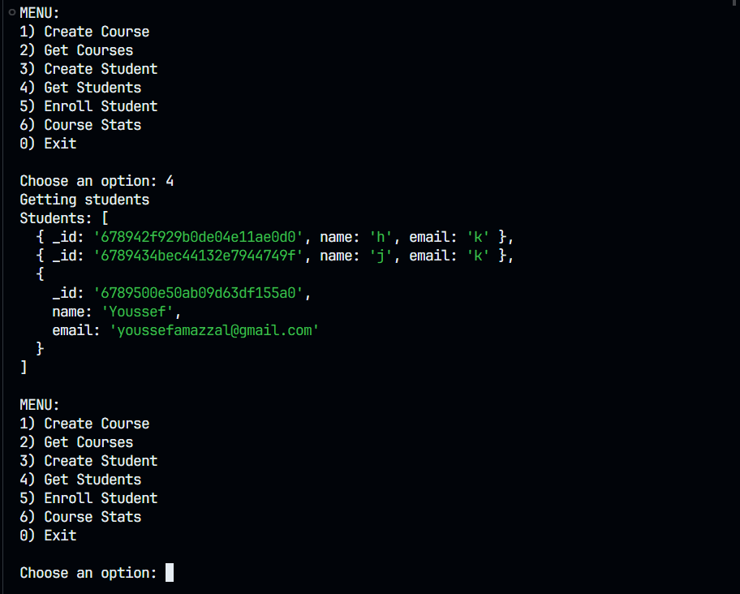
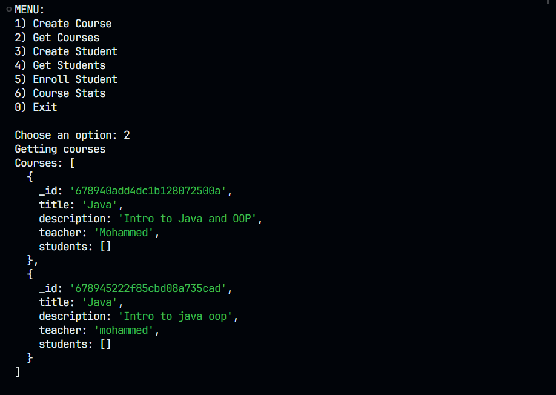

# Learning Platform Template

## Utilisation

Pour utiliser ce projet, suivez les étapes ci-dessous :

### 1. Cloner le dépôt
Clonez le dépôt sur votre machine locale :
```bash
git clone "https://github.com/youssef-amazzal/learning-platform-template"
```

### 2. Configurer votre propre dépôt
Modifiez l'origine du dépôt si nécessaire pour pointer vers votre propre dépôt.

### 3. Installer les dépendances
Installez les dépendances nécessaires :
```bash
npm install
```

### 4. Configurer les variables d'environnement
Créez un fichier `.env` à la racine du projet avec le contenu suivant :
```
# Exemple de configuration
MONGO_URI=<URI_DE_VOTRE_BASE_MONGO>
REDIS_URI=<URI_DE_VOTRE_SERVEUR_REDIS>
PORT=3000
```

### 5. Démarrer le serveur
Lancez le serveur en exécutant :
```bash
npm start
```

Le serveur sera disponible à l'adresse : [http://localhost:3000](http://localhost:3000).

### 6. Utiliser l'API
Vous pouvez interagir avec les points de terminaison de l'API à l'aide d'outils comme Postman ou cURL.

### 7. Lancer le client
Ouvrez un autre terminal et exécutez le script client :
```bash
npm run client
```

## Captures d'écran



## Questions
### Pourquoi créer un module séparé pour les connexions aux bases de données ?  
Créer un module dédié aux connexions aux bases de données permet de garder le code propre et facilement réutilisable. Cela simplifie la gestion et la maintenance, et rend le tout plus clair et organisé.

### Comment gérer proprement la fermeture des connexions ?  
Pour fermer correctement les connexions, il faut écouter les signaux de fin du processus (comme `SIGTERM`) et assurer la fermeture des bases de données avant l’arrêt complet du programme. Par exemple, dans  

`app.js` :  
```javascript
process.on('SIGTERM', async () => {
  if (db.getMongoClient()) await db.getMongoClient().close();
  if (db.getRedisClient()) await db.getRedisClient().quit();
  process.exit(0);
});
```

### Pourquoi est-il important de valider les variables d’environnement au démarrage ?  
Valider les variables d’environnement dès le départ permet de s’assurer que toutes les configurations essentielles sont correctement définies avant de lancer l’application. Cela évite les erreurs imprévues pendant le fonctionnement.

### Que se passe-t-il si une variable requise est manquante ?  
Si une variable d’environnement est absente, l’application doit afficher une erreur claire et empêcher son démarrage. Par exemple, dans  

`env.js` :  
```javascript
requiredEnvVars.forEach((varName) => {
  if (!process.env[varName]) {
    throw new Error(`Missing required env variable: ${varName}`);
  }
});
```

### Quelle est la différence entre un contrôleur et une route ?  
Une route est un chemin qui guide l’API vers un certain point, tandis qu’un contrôleur contient la logique qui traite les requêtes et génère les réponses.

### Pourquoi séparer la logique métier des routes ?  
Séparer la logique métier des routes aide à garder le code simple et bien organisé. Les routes s’occupent du routage, et les contrôleurs gèrent la logique réelle, ce qui rend le code plus facile à maintenir et à tester.

### Pourquoi créer des services séparés ?  
Créer des services distincts permet de centraliser la logique métier ou les interactions avec les bases de données, rendant le code plus modulable, facile à tester et à maintenir.

### Comment gérer efficacement le cache avec Redis ?  
Pour gérer le cache avec Redis, il est important de définir des clés uniques pour chaque entrée, de configurer des durées de vie (TTL) adaptées, et de penser à invalider le cache si les données sous-jacentes changent. Par exemple, dans  

`redisService.js` :  
```javascript
async function cacheData(key, data, ttl) {
  const client = db.getRedisClient();
  await client.set(key, JSON.stringify(data), 'EX', ttl);
}

async function getCachedData(key) {
  const client = db.getRedisClient();
  const data = await client.get(key);
  return data ? JSON.parse(data) : null;
}
```

### Quelles sont les bonnes pratiques pour les clés Redis ?  
Les bonnes pratiques incluent l’utilisation de noms de clés clairs et organisés, l’ajout de préfixes pour éviter les collisions, et la gestion de la mémoire avec des TTL. Par exemple :  
```javascript
const cacheKey = 'all_courses';
```